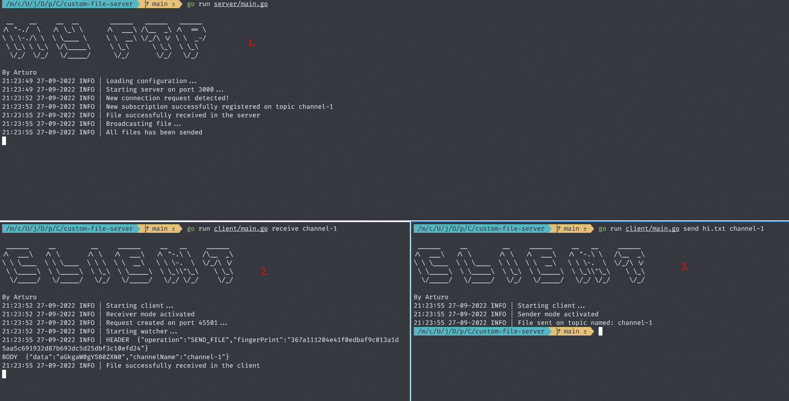

# Custom File Server Protocol with Go Sockets :file_folder: :fire:

Creating a custom file server protocol and channels cofiguraton to simulate
the communication between servers using sockets.

# Functionalities

- Server published on port 3000
- Clients can subscribe to a limited quantity of channels
- Clients can send files to channels and receive that information
- Custom formats

# How to Use It

- First start the server with `go run server/main.go`
- Then subscribe to the available channels (channel-1 to channel-5) `go run client/main.go receive channel-1`
- Then send files to the channel `go run client/main.go send hi.txt channel-1`

# Example

# References

[Intro to Socket programming in Go](https://www.developer.com/languages/intro-socket-programming-go/)
 
[Advanced Sockets](https://astaxie.gitbooks.io/build-web-application-with-golang/content/en/08.1.html)